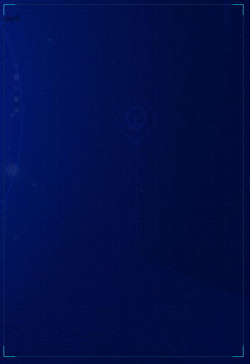
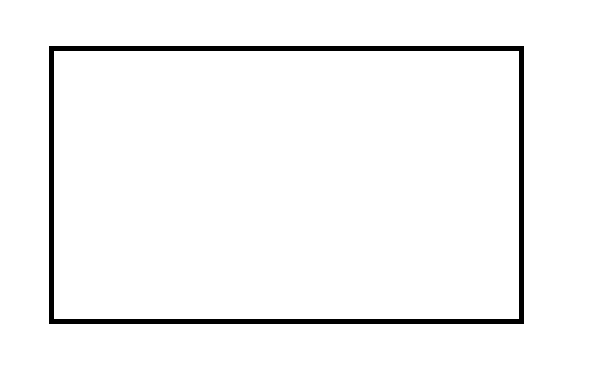
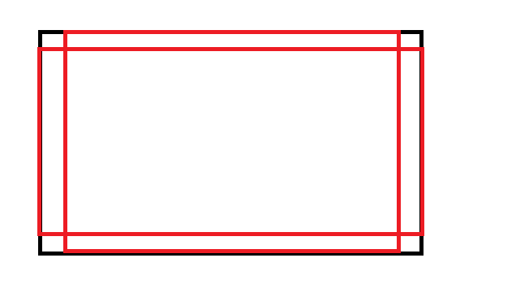
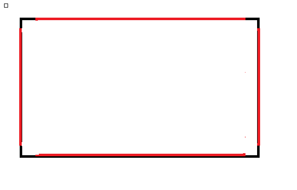
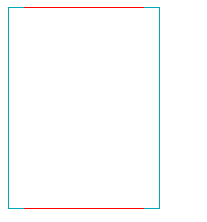
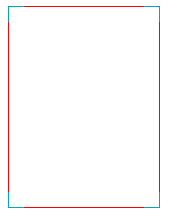

# 使用纯 CSS 实现科技化的边框的盒子

## 效果图：



## 实现原理

给一个盒子设置默认的边框颜色



然后给他设置两个伪元素



只要让横向的元素保留左右边框，纵向的元素保留上下边框即可实现对应的效果



## 代码

先给一个盒子

```css
.div {
  height: 200px;
  width: 150px;
  border: 1px solid rgba(2, 166, 181, 1); // 设置默认的边框颜色
  position: relative; // 给上相对定位  这个等下会用到
}
```

然后给盒子设置一个伪元素，一定要注意加上**pointer-events: none;**

```css
.div::after {
  content: '';
  display: block;
  border-width: 0px;
  position: absolute;
  left: 50%;
  transform: translateX(-50%);
  top: -1px; // 让他位置-1刚好贴在盒子的边框上
  width: calc(100% - 30px); // 控制30px的宽度
  height: calc(100% + 2px); // 因为他有上下共2px的边框，所以需要减掉
  background: inherit;
  background-color: rgba(255, 255, 255, 0);
  box-sizing: border-box;
  border-width: 1px;
  border-style: solid;
  border-color: red;
  border-right: 0px; // 右边的边框不显示
  border-left: 0px; // 左边的边框不显示
  border-radius: 0px;
  border-top-right-radius: 0px;
  border-bottom-left-radius: 0px;
  -moz-box-shadow: none;
  -webkit-box-shadow: none;
  box-shadow: none;
  line-height: 36px;
  pointer-events: none; // 重点 - 加上这行才不会覆盖元素内的点击
}
```

然后盒子就成了这样



接着再加上横向的伪元素

```css
.div::before {
  content: '';
  display: block;
  pointer-events: none; // 重点 - 加上这行才不会覆盖元素内的点击
  border-width: 0px;
  position: absolute;
  top: 50%;
  left: -1px; // 让他位置-1刚好贴在盒子的边框上
  transform: translateY(-50%);
  width: calc(100% + 2px);
  height: calc(100% - 30px); // 控制30px的高度
  background-color: rgba(255, 255, 255, 0);
  box-sizing: border-box;
  border-width: 1px;
  border-style: solid;
  border-color: red;
  border-top: 0px; // 上边的边框不显示
  border-bottom: 0px; // 下边的边框不显示
  border-radius: 0px;
  border-top-right-radius: 0px;
  border-bottom-left-radius: 0px;
  -moz-box-shadow: none;
  -webkit-box-shadow: none;
  box-shadow: none;
  line-height: 36px;
}
```



然后效果就完成了，各位自己替换一下边框颜色即可！
