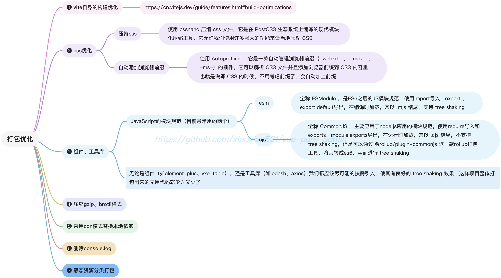

# Vite打包优化基本操作

打包优化关联着网站的稳定与加载速度，在开发中也是非常重要的一项



## `vite` 自身的构建优化

点击查看 [build-optimizations](https://cn.vitejs.dev/guide/features.html#build-optimizations) <Badge text="vite官方文档"/>

## `postcss` 配置

postcss 官网：www.postcss.com.cn/

postcss 是一个用 JavaScript 工具和插件转换 CSS 代码的工具，postcss 自身没有什么功能，只是一个平台，可以下载各种插件，从而实现一些功能！

- `Autoprefixer` 自动获取浏览器的流行度和能够支持的属性，并根据这些数据帮你自动为 CSS 规则添加前缀。
- `PostCSS Preset Env` 帮你将最新的 CSS 语法转换成大多数浏览器都能理解的语法，
- CSS 模块 能让你你永远不用担心命名太大众化而造成冲突，只要用最有意义的名字就行了。
  注：`PostCSS Preset Env` 实际预设了很多好用的 css 插件，完全可以替代`autoprefixer`使用。

postcss 可以通过在根目录创建`postcss.config.js`来进行配置，如：

```js
const postcssPresetEnv = require('postcss-preset-env')
module.exports = {
  plugins: [postcssPresetEnv(/* pluginOptions */)],
}
```

### Vite 中配置 postcss

- 在 vite.config.js 内的 css.postcss 属性内直接配置

```js
import { defineConfig } from 'vite'
export default defineConfig({
  css: {
    postcss: {
      // 一些配置
    },
  },
})
```

#### postcss-preset-env

我们主要使用`postcss-preset-env`插件，这个插件支持 css 变量和一些未来 css 语法以及自动补全(autoprefixer)

```js{7-14}
import { defineConfig } from "vite";
import postcssPresetEnv from "postcss-preset-env";
export default defineConfig({
  css: {
    postcss: {
      plugins: [
        postcssPresetEnv({
          // 其他选项
          stage: 0, // 0-4 0是最高级别 4是最低级别 默认是2 这个选项是指定要支持的浏览器版本
          autoprefixer: {
            grid: true // 是否自动添加前缀
          }
        })
      ]
    }
  }
});
```

## 组件、工具库

- 无论是组件（如 `element-plus`），还是工具库（如 `lodash`、`axios`）我们都应该尽可能的按需引入，使其有良好的  `tree-shaking` 效果，这样项目整体打包出来的无用代码就少之又少了

- 拿 `lodash` 举例，`lodash` 默认是 `cjs` 格式，不支持 `es6` 的 `import` 语法，那么我们就可以去 `github` 或者某些搜索引擎去寻找替代品，最终平台找到了 `lodash-unified`，它完全兼容 `lodash` 的全部语法并且既支持 `esm` 又支持 `cjs`，这使得它无论在浏览器还是 `node` 环境中表现都很良好。当然如果遇到那种只支持 `cjs` 格式，网上找遍了都找不到兼容 `esm` 格式的咋办呢，这时你可以参考 `lodash-unified`，看看别人是如何转换的 😊

- 平台精简版首次启动时间我这边测试是 `6` 秒，刷新页面的话开启 [CachingAsyncRoutes](https://gitee.com/yiming_chang/pure-admin-thin/blob/main/public/serverConfig.json#L19) 可能连 `1` 秒都不要，可看下面的视频。如果您使用 `pure-admin` 且当前网页`首启动`和`刷新页面`的等待时间远远大于前面的数字，也该考虑优化了。当项目具有一定规模的时候，优化并没有那么容易，所以您在写代码前就应该遵循我上面的说法，按需引入才是 `yyds` 😄  
  <video width="320" height="240" controls><source src="https://cdn.bingkele.cc/001.mov" type="video/mp4"></video>

- `vite` 目前最大的性能瓶颈是大量模块的首页加载，可看 [vite-issues](https://github.com/vitejs/vite/issues/1309#issue-777569758)，值得期待的是这个 [pr](https://github.com/vitejs/vite/pull/10671) 可能会缓解这个麻烦

## 压缩 `gzip`、`brotli` 格式

使用 [vite-plugin-compression](https://github.com/vbenjs/vite-plugin-compression) 对平台进行 `gzip` 或者 `brotli` 压缩，`nginx` 对这两种压缩模式都支持，压缩后部署到 `nginx` 将极大提高网页加载速度

### 如何开启压缩

来到 `.env.production` 文件，设置 [VITE_COMPRESSION](https://gitee.com/yiming_chang/pure-admin-thin/blob/main/.env.production#L13) 即可。设置总体分为下面两种 [具体实现代码](https://gitee.com/yiming_chang/pure-admin-thin/blob/main/build/compress.ts)

#### 两种总体设置

1. 压缩时不删除原始文件的配置
2. 压缩时删除原始文件的配置

##### 压缩时不删除原始文件的配置

```.env.production
开启 gzip 压缩
VITE_COMPRESSION = "gzip"

开启 brotli 压缩
VITE_COMPRESSION = "brotli"

# 同时开启 gzip 与 brotli 压缩
VITE_COMPRESSION = "both"

# 不开启压缩，默认
VITE_COMPRESSION = "none"
```

##### 压缩时删除原始文件的配置

```.env.production
开启 gzip 压缩
VITE_COMPRESSION = "gzip-clear"

开启 brotli 压缩
VITE_COMPRESSION = "brotli-clear"

# 同时开启 gzip 与 brotli 压缩
VITE_COMPRESSION = "both-clear"

# 不开启压缩，默认
VITE_COMPRESSION = "none"
```

## 采用 `cdn` 模式替换本地依赖

### `vite` 插件

使用 [vite-plugin-cdn-import](https://github.com/MMF-FE/vite-plugin-cdn-import/blob/master/README.zh-CN.md) 插件，在打包时将指定的 `modules` 替换成 `cdn` 链接，从而减少构建时间，提高生产环境中页面加载速度。

### `cdn` 厂商（免费）

平台 `cdn` 采用的是国内 [bootcdn](https://www.bootcdn.cn)，主要是稳定并且快，当然您也可以选择 [unpkg](https://unpkg.com) 或者 [jsdelivr](https://www.jsdelivr.com)，这两个 `cdn` 是国外的

### 如何启动 `cdn` 替换

来到 `.env.production` 文件，将 [VITE_CDN](https://gitee.com/yiming_chang/pure-admin-thin/blob/main/.env.production#L8) 设置成 `true` 即可

### 默认启动 `cdn` 替换的模块有哪些

`vue`、`vue-router`、`vue-demi`、`pinia`、`element-plus`、`axios`、`dayjs`、`echarts` 具体代码 [build/cdn.ts](https://gitee.com/yiming_chang/pure-admin-thin/blob/main/build/cdn.ts)

## 生产环境删除 `console.log`

使用平台开发的 [vite-plugin-remove-console](https://github.com/xiaoxian521/vite-plugin-remove-console) 插件，在打包构建时移除平台中所有的 `console.log`

## 静态资源分类打包

`vite` 是基于 `esbuild` 和 `rollup` 构建的，在打包时如果不进行 `output` 的配置，就会把所有文件都混在一起）

在配置`output`后的效果，所有文件都进行了分类存放，这也方便我们查找文件

来到 vite.config.js 文件，可以看到我们对 output 进行了如下配置

```js {9-13}
build: {
  sourcemap: false,
  // 消除打包大小超过500kb警告
  chunkSizeWarningLimit: 4000,
  rollupOptions: {
    input: {
      index: pathResolve("index.html")
    },
    // 静态资源分类打包
    output: {
      chunkFileNames: "static/js/[name]-[hash].js",
      entryFileNames: "static/js/[name]-[hash].js",
      assetFileNames: "static/[ext]/[name]-[hash].[ext]"
    }
  }
}
```

:::tip 相关推荐
[Vite 代码拆包插件。支持多种拆包策略，可避免手动操作 manualChunks 潜在的循环依赖问题](https://github.com/sanyuan0704/vite-plugin-chunk-split/blob/master/README-CN.md)
:::

## `svg` 压缩

一般下载的 `svg` 或者复制的 `svg` 代码，里面存在一些无关紧要的元素，可以将其剔除，毫无影响地降低 `svg` 大小  
平台使用了 [svgo](https://www.npmjs.com/package/svgo) 工具对所有 `svg` 进行了压缩，您拉取平台代码时所有 `svg` 都已经最简了哦。当然您会问自己新加的 `svg` 如何精简呢，来到 [main/package.json](https://gitee.com/yiming_chang/pure-admin-thin/blob/main/package.json#L14)，可以看到平台默认使用 `svgo` 工具对 `src/assets/svg` 文件夹里的所有 `svg` 进行压缩，这是可以改动的，只需要将 `-f` 和 `-o` 后的路径改为您需要压缩的 `svg` 路径即可。温馨提示：只需要运行 `pnpm svgo` 命令对 `svg` 文件进行一次压缩即可

:::tip 推荐阅读

- [性能优化](https://cn.vuejs.org/guide/best-practices/performance.html) <Badge text="vue文档"/>
- [Vite 中组件按组分块打包](https://router.vuejs.org/zh/guide/advanced/lazy-loading.html#%E4%BD%BF%E7%94%A8-vite) <Badge text="vue-router文档"/>
  :::

::: tip 传送门
[原文地址](https://yiming_chang.gitee.io/pure-admin-doc/pages/buildgood/#vite-%E8%87%AA%E8%BA%AB%E7%9A%84%E6%9E%84%E5%BB%BA%E4%BC%98%E5%8C%96)
:::
