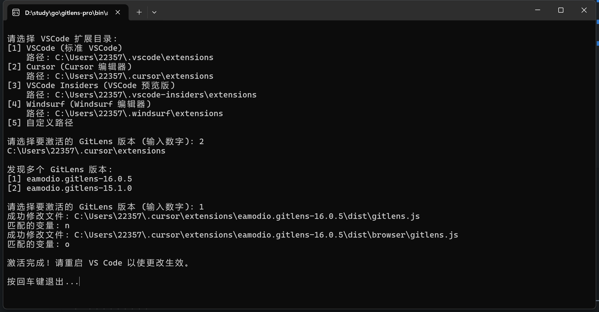
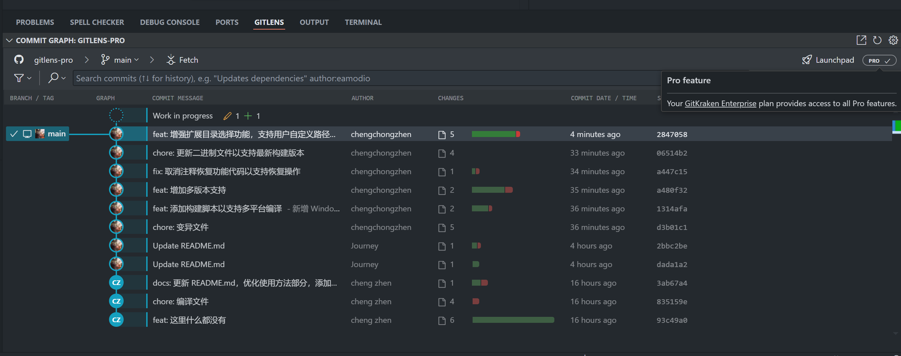
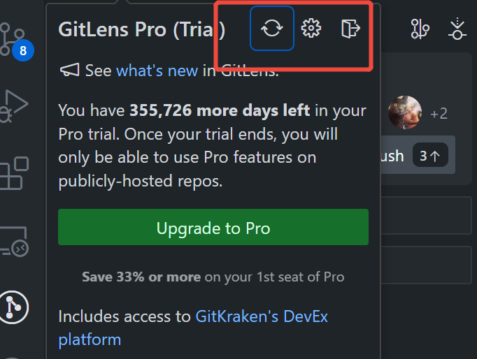

# VS Code 插件 Gitlens Pro破解版

## 要求

推荐使用 15.1.0 版本的 GitLens, 新版本应该也支持

必须登录, 这是必须的步骤, 注册随便用个邮箱就行, 不登陆没法触发

## 使用方法

运行之后会有相关提示，根据提示操作即可



效果


### Windows 用户

双击运行

```
activate.exe
```

### macOS 用户

直接运行 `activate_mac` 即可。

```bash
chmod +x activate_mac_arm64 && ./activate_mac_arm64
```

### Linux 用户

直接运行 `activate` 即可。

```bash
./activate
```

## 如果是高版本的gitlens，执行之后需要点击刷新按钮



下载地址： [https://hcer.lanzoub.com/iqe8t3m7nwqj](https://hcer.lanzoub.com/iqe8t3m7nwqj)
