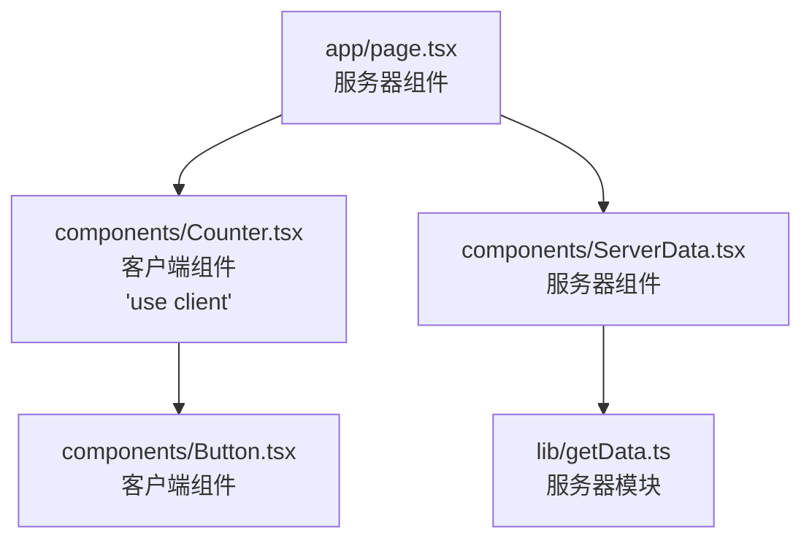

# Next.js 中文文档 - use client

`'use client'` 指令用于声明一个组件作为[客户端组件](/nextjs/app-router/building-your-application/rendering/client-components)的组件边界。

```tsx
'use client'

import { useState } from 'react'

export default function Counter() {
  const [count, setCount] = useState(0)

  return (
    <div>
      <p>计数: {count}</p>
      <button onClick={() => setCount(count + 1)}>点击</button>
    </div>
  )
}
```

## 用法

`'use client'` 指令必须出现在模块文件的顶部，位于导入语句之前。它不能放在嵌套函数、块或组件内部。

指令的影响是该模块中的所有组件（包括导出的所有组件和从该文件中导入的子组件）都将被视为客户端组件，并且将被包含在客户端JavaScript包中。

### 服务器模块和客户端模块

随着项目的增长，您的代码库会分成在服务器或客户端环境中运行的模块。

**服务器模块**：

- 只在服务器环境中运行
- 包含服务器组件
- 可以导入和使用其他服务器模块
- 不能导入客户端模块

**客户端模块**:

- 主要在客户端环境中运行
- 包含客户端组件，但在服务器端也会进行预渲染
- 可以导入和使用其他客户端模块
- 不能导入服务器模块（会产生错误）

模块环境的转换是从服务器组件（默认）到客户端组件的单向、自上而下的过程，通过`'use client'`指令实现。

### 组件模块图

下面的图表展示了服务器组件和客户端组件如何相互交互：



在这个例子中：

- `app/page.tsx`是一个服务器组件
- `components/Counter.tsx`使用`'use client'`声明为客户端组件
- `components/Button.tsx`被客户端组件导入，因此也是客户端组件
- `components/ServerData.tsx`只被服务器组件导入，因此仍然是服务器组件
- `lib/getData.ts`是一个在服务器上执行的模块

### 什么时候使用'use client'

在App Router中，所有组件默认都是服务器组件。您只需要在需要客户端特性的组件中添加`'use client'`指令。使用客户端组件的情况包括：

1. 使用**交互性和事件监听器**（如`onClick`、`onChange`等）
2. 使用**状态和生命周期特性**（如`useState`、`useReducer`、`useEffect`等）
3. 使用**浏览器专用API**（如`window`、`localStorage`等）
4. 使用**依赖于上述功能的自定义钩子**
5. 使用**React类组件**

### 常见模式和优化

1. **将'use client'放置在叶子组件上**：
   尽量让`'use client'`指令更靠近需要客户端功能的组件，而不是放在根组件上。这可以优化构建大小，只包含真正需要客户端功能的组件。

```jsx
// app/page.js (服务器组件) - 不需要'use client'
import ClientComponent from './client-component'

export default function Page() {
  // 这段代码在服务器上执行
  const data = fetchData()

  return (
    <div>
      <h1>服务器渲染内容</h1>
      <ClientComponent data={data} />
    </div>
  )
}
```

```jsx
// client-component.js (客户端组件)
'use client'

import { useState } from 'react'

export default function ClientComponent({ data }) {
  const [isVisible, setIsVisible] = useState(false)

  return (
    <div>
      <button onClick={() => setIsVisible(!isVisible)}>显示/隐藏</button>
      {isVisible && <div>{data}</div>}
    </div>
  )
}
```

2. **共享客户端组件**：
   可以在多个文件中导入和重用客户端组件。一旦组件标记为`'use client'`，就不需要在导入它的每个文件中再次声明。

```jsx
// components/button.js
'use client'

export function Button({ children, onClick }) {
  return <button onClick={onClick}>{children}</button>
}
```

```jsx
// app/page.js - 无需'use client'
import { Button } from '@/components/button'

export default function Page() {
  return (
    <div>
      <Button onClick={() => console.log('服务器组件内导入的客户端组件')}>点击</Button>
    </div>
  )
}
```

3. **将数据获取保持在服务器组件中**：
   即使需要客户端功能，也可以在服务器组件中获取数据，然后将数据作为props传递给客户端组件，这样可以避免在客户端组件中进行网络请求。

```jsx
// app/page.js (服务器组件)
import ClientComponent from './client-component'

export default async function Page() {
  // 在服务器端获取数据
  const data = await fetch('https://...')
  const result = await data.json()

  // 将数据传递给客户端组件
  return <ClientComponent data={result} />
}
```

### 常见问题

1. **"使用'use client'之前导入X模块"错误**

   确保将`'use client'`指令放在文件的最顶部，在所有导入之前：

```tsx
'use client'

// 正确: 'use client'位于所有导入之前
import { useState } from 'react'
```

2. **"无法在客户端组件中导入服务器组件"错误**

   客户端组件不能导入和使用服务器组件，因为服务器组件的代码不会包含在客户端JavaScript包中。解决方法是"倒置"组件关系，让服务器组件导入并包装客户端组件：

```jsx
// app/client-component.js
'use client'

export default function ClientComponent({ children }) {
  return <div>{children}</div>
}
```

```jsx
// app/page.js
import ClientComponent from './client-component'
import ServerComponent from './server-component'

export default function Page() {
  return (
    <ClientComponent>
      <ServerComponent />
    </ClientComponent>
  )
}
```

3. **从第三方库导入的组件**

   当从依赖于浏览器API的第三方库导入组件时，应该在包装组件上使用`'use client'`：

```jsx
'use client'

import { ThirdPartyComponent } from 'third-party-library'

export default function ClientWrapper({ children }) {
  return <ThirdPartyComponent>{children}</ThirdPartyComponent>
}
```

## 自动在客户端导入的模块

App Router有一组自动导入到客户端的特定文件和文件夹，作为优化约定，您不需要在这些文件中添加`'use client'`：

- `/app/client-components/` 文件夹中的组件
- 所有带有 `.client.js` 后缀的文件
- 布局中导入的CSS文件

## 相关文档

- [客户端组件](/nextjs/app-router/building-your-application/rendering/client-components)
- [服务器组件](/nextjs/app-router/building-your-application/rendering/server-components)
- [组合模式](/nextjs/app-router/building-your-application/rendering/composition-patterns)
- ['use server'指令](/nextjs/app-router/api-reference/directives/use-server)
